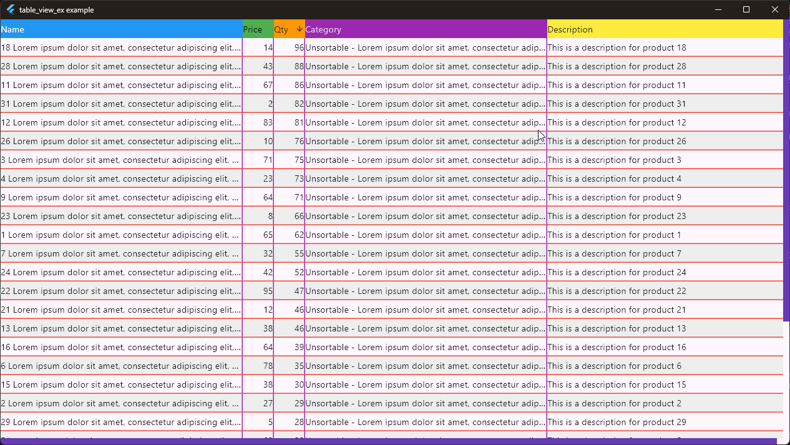

[](https://pub.dev/packages/table_view_ex) [](https://github.com/cnayan/table_view_ex/blob/main/LICENSE) [](https://github.com/cnayan/table_view_ex/actions) [](https://codecov.io/gh/cnayan/table_view_ex)

# TableViewEx

A powerful, Flutter table widget with a rich set of features for enhanced user interaction and customization. It's an extended `TableView` control to present multi-column data. It is built on top of Flutter's [two_dimensional_scrollables](https://pub.dev/packages/two_dimensional_scrollables) library.

The main control to use is `ViewOnlyTableViewEx`.

---

## Why do I need it?

I'm glad you asked! `TableView` is great to present data (read [full set of features](https://github.com/flutter/packages/blob/main/packages/two_dimensional_scrollables/README.md)), but it skipped on some features that are desired in many places. Some of the features that were missing and have been implmented here:
- Column width change: Flutter is no longer limited to mobile and tablet devices. On a traditional PC desktop, you would be using mouse or similar pointing devices. In those situations, you may want to expand or shrink width of certain columns. This is implemented in `TableViewEx`.
- Column re-arrangement: If you need to rearrange columns - moving them left or right - this is implemented in `TableViewEx`. Now you can drag and drop over other column.
- Column sorting: `TableViewEx` allows the user to sort the column according to configured comparison algorithm with visual indicator.

`TableViewEx` makes it slightly easier to configure and customize `TableView`.

## Screenshot



## Requirements

- Flutter SDK
- `two_dimensional_scrollables` package
- Dart SDK version compatible with null safety

## General
- `ViewOnlyTableViewEx` is composed of its own features and an instance of `TableView` from `two_dimensional_scrollables` package.
- Column width calculations are performed once and cached for optimal performance
- The widget maintains state for column resizing, reordering, and sorting operations
- Proper hit-testing ensures resize handles don't interfere with drag-and-drop operations

## Features
- **Column Resizing**: Users can dynamically resize columns by dragging the column dividers.
- **Column Reordering**: Easily reorder columns using intuitive drag-and-drop functionality.
- **Column Sorting**: Supports data sorting with visual indicators (ascending/descending arrows) in the header.
- **Customizable Scrollbars**: Fine-tune the visibility, color, and thickness of both vertical and horizontal scrollbars.
- **Custom Row Colors**: Apply custom colors to rows for improved readability and aesthetics.
- **Configurable Borders**: Define custom styles for horizontal and vertical borders between cells.
- **Auto-fit Column Width**: Double-click a column divider to automatically resize the column to fit its content.
- **Pinned Header**: An optional header row that remains visible while scrolling vertically through the data (carried over from `TableView`).

## Details

### Column Resizing

Users can resize columns by:
1. Hovering over the right edge of a column header (cursor changes to resize indicator)
2. Dragging to adjust width
3. Double-clicking to auto-fit content (requires `contentMaxWidthProvider`)

To have auto-fit content, you need to provide `contentMaxWidthProvider` like:

```dart
contentMaxWidthProvider:
    (colIndex) => _myContentMaxWidthCalculator(columnDefs[colIndex], rows),
```

Since it is up to you - what you want to put in the table cells - the control cannot assume it to be directly measurable. Hence, this implementation shall be provided by you.
Suppose your content is made up of string/num or basic data type content, you can use this kind of implementation:

```dart
  /// Find widest cell content in pixels
  double _myContentMaxWidthCalculator(
      TableViewExColumnConfig columnDef,
	  List<Map<String, String?>> rows) {
    double maxWidth = 0.0;
    for (int rowIndex = 0; rowIndex < rows.length; rowIndex++) {
      final Map<String, String?> row = rows[rowIndex];
      String contentAsText;
      if (row[columnDef.key] == null) {
        contentAsText = "";
      } else if (row[columnDef.key] is String) {
        contentAsText = row[columnDef.key] as String;
      } else {
        // Force the text conversion - can be controlled by you
        contentAsText = row[columnDef.key].toString();
      }

      final measuredWidth = _measureTextSize(contentAsText, null).width;
      maxWidth = max(maxWidth, measuredWidth);
    }

    return maxWidth;
  }

  /// Rough estimation of the text size in pixels
  Size _measureTextSize(String? text, TextStyle? style) {
    if (text == null || text.isEmpty) {
      return Size.zero;
    }
  
    final TextPainter textPainter = TextPainter(
      text: TextSpan(text: text, style: style),
      maxLines: 1,
      textDirection: TextDirection.ltr,
    )..layout(minWidth: 0, maxWidth: double.infinity);
    return textPainter.size;
  }
```

### Content Sorting

Implement sorting by providing an `onSortRequested` callback. The widget will automatically display sort indicators (up/down arrows) for the currently sorted column.

```dart
onSortRequested: (columnIndex) {
  yourSortingMethod(columnIndex);
  setState(() {
    // Update your data source
  });
},
```

### Column Reordering

Enable column reordering by setting `allowColumnReordering: true`. Users can then drag column headers to reorder them.

**Note**: In order to deal with reordering of columns along with sorted column tracking, you need to write your `Action<TableViewExSortedColumnMovedIntent>` handler. Essentially, if you have sorted the data on a column, and then proceeded with reordering, the sorted column index may be required to be tracked outside the control, as the sorting of content is done by consumer of the `ViewOnlyTableViewEx` control. The `ViewOnlyTableViewEx` control raises action for the intent `TableViewExSortedColumnMovedIntent` which the control's parent need to track.

Sample action handler:

```dart
class TableViewExSortedColumnMovedIntentHandler
    extends Action<TableViewExSortedColumnMovedIntent> {
  final void Function(int newSortedColumnIndex) onNotified;

  TableViewExSortedColumnMovedIntentHandler(this.onNotified);

  @override
  void invoke(covariant TableViewExSortedColumnMovedIntent intent)
    => onNotified(intent.newSortedColumnIndex);
}
```

Full code is available in the example app.

### Custom Row Colors

Here in this sample, we create zebra-striped tables with custom row colors:

```dart
rowBackgroundColorProvider:
     (rowIndex) => rowIndex.isEven ? Colors.grey[50]! : Colors.white,
```

### Initial Column Width - Custom Calculations:

In case you need to compute your own column widths, implement your `TableViewExWidthCalculator`, like this:

```dart
class MyTableViewExWidthCalculator extends TableViewExWidthCalculator {
  /// Calculate the actual pixel widths based on the current constraints
  @override
  List<double> calculateColumnWidths(
	double viewportWidth,
	List<TableViewExColumnConfig> columnDefinitions) {
	// your logic - divide viewportWidth among the number of columns.

	// Just ensure that your output array length is same as the length of `columnDefinitions`.
	return [ ... ];
  }
}
```

Then consume it when creating instance of `ViewOnlyTableViewEx` via:
```dart
columnWidthCalculator : MyTableViewExWidthCalculator()
```

---

## Configurable Properties

### Scrollbar Customization:
- `scrollThumbColor`: The color of the scrollbar thumb. Defaults to `Colors.grey`.
- `scrollThumbThickness`: The thickness of the scrollbar thumb. Defaults to `6.0`.
- `verticalThumbVisibility`: Allows visibility control of the vertical scrollbar.
- `horizontalThumbVisibility`: Allows visibility control of the horizontal scrollbar.
  - *Note*: If both visibility properties are set to `false`, the scrollbars will be completely hidden.

### Column Behavior:
- `columnDefinitions`: A **required** list of `TableViewExColumnConfig` objects that define the structure, style, and behavior of each column.
- `enableColumnWidthResize`: A boolean to enable or disable column resizing by dragging. Defaults to `true`.
- `allowColumnReordering`: A boolean to enable or disable column reordering via drag-and-drop. Defaults to `false`.
- `resizingSeparatorWidth`: The width of the draggable separator used for resizing columns. Defaults to `3.0`.
- `contentMaxWidthProvider`: An optional function `double Function(int colIndex)` that provides the maximum width for a column's content. This is used for the auto-resize on double-tap feature.

### Row & Cell Configuration:
- `rowCount`: The **required** total number of rows in the table.
- `rowSpanBuilder`: A **required** function `SpanExtent Function(int)` to build the height (`SpanExtent`) for each row.
- `cellWidgetBuilder`: A **required** function `Widget Function(BuildContext, TableVicinity)` to build the widget for each individual cell in the table.
- `rowBackgroundColorProvider`: An optional function `Color Function(int rowIndex)` to provide alternating or conditional background colors for rows.
- `showHeader`: A boolean that, when `true`, treats the first row as a pinned header. Defaults to `false`.

### Styling and Borders:
- `horizontalBorderSide`: Defines the `BorderSide` for the horizontal lines between rows. If omitted, no horizontal lines are drawn.
- `verticalBorderSide`: Defines the `BorderSide` for the vertical lines between columns. If omitted, no vertical lines are drawn.

### Core Functionality:
- `onSortRequested`: An optional callback `void Function(int colIndex)` that is triggered when a header is tapped, signaling a sort request.
- `columnWidthCalculator`: A **required** instance of a `TableViewExWidthCalculator` implementation, which is responsible for determining the initial widths of the columns. This package comes with a default implementation named as `DefaultTableViewExWidthCalculator` for use.

---

## Usage

Please check the [example folder](./example) which demonstrates various features of the widget.

##  Know issues/limitations/caveats
- Any limitation of `TableView` will impact this control. Kindly check the issues of that package to see if your concern is addressed there.

## License

Copyright 2025 Nayan Choudhary. All rights reserved.
Use of this source code is governed by a MIT license.
